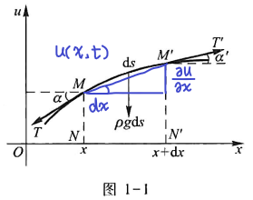

## 1.1 三大基本方程

### 一、弦的横振动方程

1. 物理现象：紧绷的弦在平衡位置附近的**微小**的横振动
2. 物理模型
   + 均匀的
   + 弹性的：弦内张力，胡克定律
   + 柔软的：弯曲，弦内张力沿切线方向
   + 细：几何上的线，不计重量
   + 在平衡位置附近微小的横振动
     + 横振动：在平面内
     + 微小：
       + 位移$u$很小
       + 相对位移$\frac{\partial u}{\partial x}$很小
       + 夹角$\alpha、\alpha'\to0$
   + 除了重力之外不受任何外力的作用
3. 数学模型：建立坐标系，确定未知函数
   + 设位移函数$u(x,t)$：$t$时刻，$x$处的弦的位移  
     </img>
4. 建立偏微分方程
    $$
        F=ma,\quad m=\rho ds,\quad a=\frac{\partial^2 u}{\partial t^2}\\
        ds\approx\sqrt{dx^2+{(dx\frac{\partial u}{\partial x})^2}}=\sqrt{1+(\frac{\partial u}{\partial x})^2}dx\approx dx\\
        G=\rho gds
    $$
    在$x$轴方向上，弧段$\overset{\frown}{MM'}$的受力有 $\  T'cos\alpha'=Tcos\alpha，\alpha\approx0,\alpha'\approx0$. 当$\alpha\to0$时，
    $$cos\alpha=1-\frac{\alpha^2}{2!}+\frac{\alpha^4}{4!}-\cdots$$
    所以x轴方向上近似有$T=T'.\\$  
    在u方向上，受力为$-Tsin\alpha+T'sin\alpha'-\rho gds\\$  
    当$sin\alpha\approx0，sin\alpha'\approx0$时，
    $$
    sin\alpha\approx tan\alpha=\frac{\partial u(x,t)}{\partial x},\\
    sin\alpha'\approx tan\alpha'=\frac{\partial u(x+dx,t)}{\partial x},\\
    ds=dx\\
    a=\frac{\partial^2 u(x,t)}{\partial t^2}
    $$
    所以
    $$
    -Tsin\alpha+T'sin\alpha'-\rho gds\approx\rho ds\frac{\partial^2 u(x,t)}{\partial t^2}   \tag{*}
    $$
    对于
    $$
    \begin{aligned}
        -Tsin\alpha+T'sin\alpha'&=T(\left.\frac{\partial u}{\partial x}\right|_{x+dx}-\left.\frac{\partial u}{\partial x}\right|_{x})\\&\approx T\frac{\partial}{\partial x}(\frac{\partial u}{\partial x})dx\\
        &=T
    \end{aligned}
    $$
    带入*式有
    $$
    \frac{T}{\rho}\frac{\partial^2u}{\partial x^2}\approx\frac{\partial^2u}{\partial t^2}+g
    $$
    在张力较大时，加速度$\ a$ 要比 $g$ 大得多，可以略去 $g$ ，就能得到最终 $u(x,t)$ 应近似满足$$\frac{\partial^2u}{\partial t^2}=a^2\frac{\partial^2u}{\partial x^2}，\quad a^2=\frac{T}{\rho}\tag{1}$$
    式子(1)就是**一维波动方程**，这个方程是一个**二阶常系数齐次线性偏微分方程**。
5. 物理含义
   + 质点——常微分方程
   + 弦——偏微分方程
6. 扩展
    1. 受到外力$F(x,t)$（单位长度上受到的力）
       可得弦的强迫震动方程
       $$
       \frac{\partial^2u}{\partial t^2}=a^2\frac{\partial^2u}{\partial x^2}+f(x,t)，\quad a^2=\frac{T}{\rho}\tag{1'}
       $$
       这是一个**非齐次**方程
    2. 
7. 